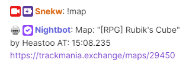

# SNWTMMap

Utility to get last played map info through a web API.

Used with https://github.com/Snekw/SNWTM. Hosted version https://tm.snekw.com/map.

Requires a token from https://tm.snekw.com/map or self hosted version of https://github.com/Snekw/SNWTM.

## Config

* Enabled - Toggle if the plugin is enabled or not. When enabled will send the map info shortly after map load.
* Token - Token that is used to authenticate the map data when sending to server. This is private information and shouldn't be shared with others.

### Advanced

* Endpoint - Used if a self hosted version of SNWTM is used. Set to the URL to the API of the self hosted version.

### Restore Web

* Contains methods to retrieve the currently in use token to use to restore the web page if the web page token fails to restore automatically.
